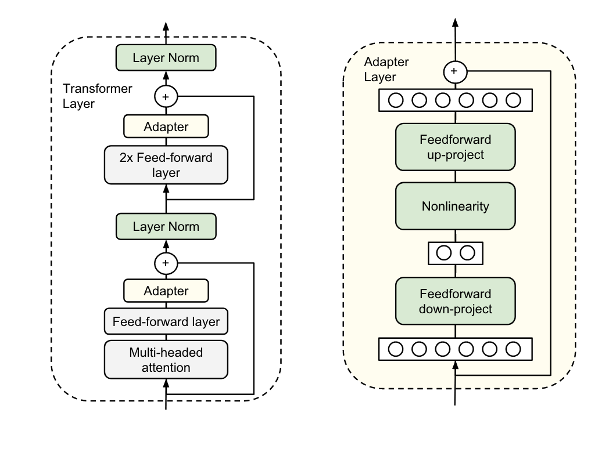

# Adapter Tuning

## 方法介绍

论文：***Parameter-Efficient Transfer Learning for NLP(2019)***

如图所示，论文将设计的adapter模块嵌入每个Transformer层，具体来说是多头注意力层的投影之后和两个feed-forward层之后。训练的时候只对新增的adapter模块、Layer Norm层（图中绿色部分）、最后的分类层进行微调。针对每个下游任务，都可以训练一个相应的adapter模块，避免全量微调和灾难性遗忘的问题。

每个adapter模块是怎么设计的呢？如上图右边所示，每个adapter模块由2个前馈(Feedforward)子层组成，第一个前馈层down-project）接收Transformer的输出作为输入，将输入维度d（高维特征）投影到m（低维特征），通过控制m的大小来限制Adapter模块的参数量，通常情况下，`m<<d`。然后，中间通过一个非线形层。接着通过第二个前馈层（up-project）还原输入维度，将m（低维特征）重新映射回d（原来的高维特征），作为Adapter模块的输出。同时，通过一个skip connection来将Adapter的输入加到最终的输出中去，这样可以保证，即便 Adapter 一开始的参数初始化接近0，Adapter也由于skip connection的设置而接近于一个恒等映射，从而确保训练的有效性。

通过实验发现，只训练少量参数的Adapter方法的效果可以媲美全量微调，这也验证了Adapter是一种高效的参数训练方法，可以快速将语言模型的能力迁移到下游任务中去。同时，可以看到，Adapter 最佳的中间层特征维度m视数据集的大小而异，如：MINI数据集为256，最小的RTE数据集为8。如果始终将维度限制在64，将导致平均准确率略微下降。

总之，Adapter通过引入0.5%～5%的模型参数可以达到不落后全量微调模型1%的性能。

## 相关资料

https://mp.weixin.qq.com/s/e9avoS_i-Zqm_YFZN_5IZw
