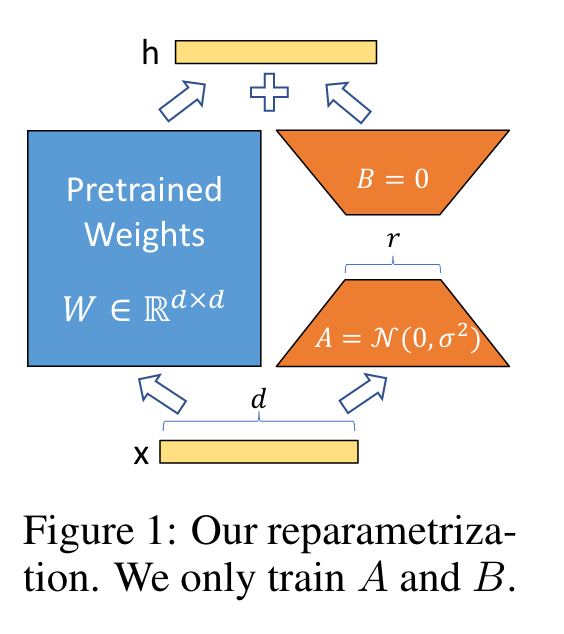

# Lora

## 方法介绍

之前的方法存在的缺点
- adapter tuning因为有额外的adapter模块，所以会引入额外的计算，造成推理延迟
- prefix tuning很难优化，且它的表现不是随着训练参数单调增长的。另外，它还会占用一部分的输入长度。

论文：***LoRA: Low-Rank Adaptation of Large Language Models（2021）***

Low-Rank Adaptation（低秩适应）的思想得益于前人关于内在维度（intrinsic dimension）的发现：模型是过参数化的，它们有更小的内在维度，模型主要依赖于这个低的内在维度去做任务适配。论文作者则假设模型在任务适配过程中权重的改变量是低秩（low rank）的，由此提出低秩自适应（LoRA）方法，LoRA允许我们通过优化适应过程中密集层 (dense layer) 变化的秩分解矩阵来间接训练神经网络中的一些密集层，同时保持预先训练的权重不变。

也就是说，对于很多任务，模型的参数量可能包含冗余信息，我们可以通过只优化部分参数就能近似达到优化全量参数的效果。



具体做法

- 在原模型旁边增加一个旁路，**通过低秩分解（先降维再升维）来模拟参数的更新量**；
- 训练时，原模型固定，只训练降维矩阵A($d\times r$的维度)和升维矩阵B($r\times k$的维度)，其中$r << min(d,k)$；
- 推理时，可将BA加到原参数上，不引入额外的推理延迟；
- 初始化，A采用高斯分布初始化，B初始化为全0，保证训练开始时旁路为0矩阵；
- 可插拔式的切换任务，当前任务W0+B1A1，将lora部分减掉，换成B2A2，即可实现任务切换；

理论上，LORA可以应用到任何模块的权重矩阵中。Transformer的权重矩阵包括Attention模块里用于计算query, key, value的Wq，Wk，Wv以及多头attention的Wo,以及MLP层的权重矩阵。LoRA论文的实验只应用在了Attention模块中的4种权重矩阵。

一些实验结论
- 只调整Wq或者Wk性能较差，同时调整 Wq 和 Wv 会产生最佳结果。
- 保证权重矩阵的种类的数量比起增加隐藏层维度r更为重要，增加r并不一定能覆盖更加有意义的子空间。
- 关于秩的选择，通常情况下，rank为4，8，16即可。
- 在众多数据集上LoRA在只训练极少量参数的前提下，最终在性能上能和全量微调匹配，甚至在某些任务上优于全量微调。

## 代码实现

1.lora的实现（源自peft库，见代码）


2.使用peft库进行lora微调和推理

使用lora训练的核心代码

```python
from peft import LoraConfig, get_peft_model, prepare_model_for_int8_training

lora_config = json.load(open(training_args.lora_config))
config = LoraConfig(
            r=lora_config["lora_r"],
            lora_alpha=lora_config["lora_alpha"],
            target_modules=lora_config["lora_target_modules"],
            lora_dropout=lora_config["lora_dropout"],
            bias="none",
            task_type="CAUSAL_LM",
        )
model = get_peft_model(model, config)
model.print_trainable_parameters()
```


推理的时候需要将训练好的lora模型和原模型合并

```python
base_model = AutoModelForCausalLM.from_pretrained(args.model_name_or_path, torch_dtype=load_type)
model = PeftModel.from_pretrained(base_model, args.ckpt_path, torch_dtype=load_type)

```

或者也可以提前合并好再进行推理

```python
def apply_lora(model_name_or_path, output_path, lora_path):
    print(f"Loading the base model from {model_name_or_path}")
    base = AutoModelForCausalLM.from_pretrained(
        model_name_or_path, torch_dtype=torch.float16, low_cpu_mem_usage=True
    )
    if args.llama:
        base_tokenizer = LlamaTokenizer.from_pretrained(model_name_or_path)
    else:
        base_tokenizer = AutoTokenizer.from_pretrained(model_name_or_path)

    print(f"Loading the LoRA adapter from {lora_path}")

    lora_model = PeftModel.from_pretrained(
        base,
        lora_path,
        torch_dtype=torch.float16,
    )

    print("Applying the LoRA")
    model = lora_model.merge_and_unload()

    print(f"Saving the target model to {output_path}")
    model.save_pretrained(output_path)
    base_tokenizer.save_pretrained(output_path)
```

## 相关资料
