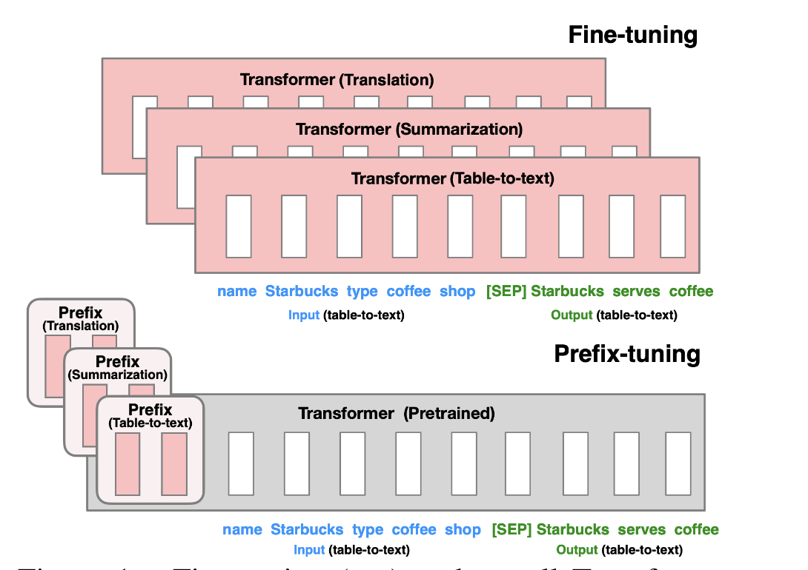
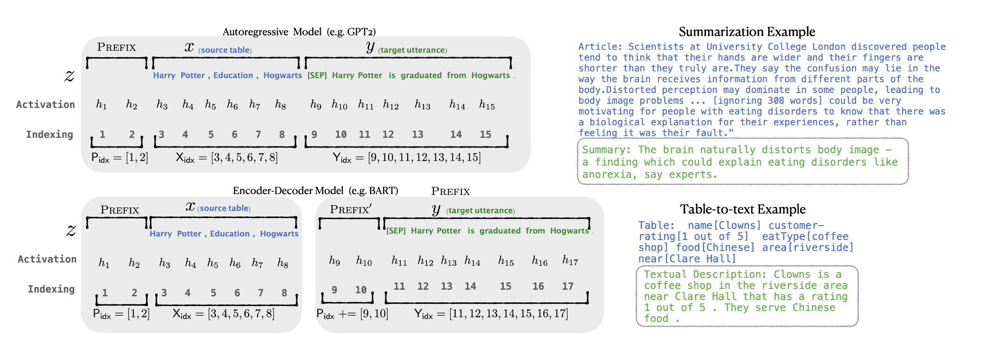

# Prefix-tuning

## 方法介绍

论文：***Prefix-Tuning: Optimizing Continuous Prompts for Generation（2021）*** 



Prefix-Tuning的做法是，在输入之前加上一段连续的特定任务的向量（称为Prefix）。相比于输入的真实token，Prefix可以看作是virtual tokens。Finetune的时候冻结预训练模型的参数，只需要Finetune图中的Prefix部分参数，参数量只占整体模型的0.1%。

核心思想：基于prompt的思想能够发现，合适的上下文可以在不改变模型参数的情况下引导语言模型生成合适的结果。因此，Prefix-tuning希望通过Prefix模块影响输入x的编码结果和输出y的生成结果。



构造Prefix的方法
- 针对自回归架构模型：在句子前面添加前缀，得到 z = [PREFIX; x; y]，合适的上文能够在固定 LM 的情况下去引导生成下文（比如：GPT3的上下文学习）。
- 针对编码器-解码器架构模型：Encoder和Decoder都增加了前缀，得到 z = [PREFIX; x; PREFIX'; y]。Encoder端增加前缀是为了引导输入部分的编码，Decoder 端增加前缀是为了引导后续token的生成。

$P_{idx}$表示Prefix的索引序列，每一个prefix id都对应一个随机初始化的embedding，不同的任务有不同的prefix id。

实验中发现，直接更新Prefix的参数容易导致训练优化不稳定，性能也会有所下降，且对学习率和参数初始化非常敏感。因此作者在Prefix层前面加了MLP结构，训练完成后，只保留Prefix的参数。

论文还针对Prefix长度, 参数初始化方法等做了实验。

- 在摘要和table-to-text这2个任务上，模型性能随着prefix长度分别增长到200和10到达了一个最高点，随后性能就开始下降。

- 在参数初始化方面，用任务相关的词初始化的效果>任务无关的词初始化>随机初始化。

## 代码实现

1.prefix-tuning如何实现（源自peft库，见代码）


2.使用peft库进行prefix-tuning训练和推理

使用Prefix-Tuning 训练的核心代码
```python
peft_config = PrefixTuningConfig(task_type=TaskType.CAUSAL_LM, num_virtual_tokens=30)
model = get_peft_model(model, peft_config)
model.print_trainable_parameters()
```

推理
```python
base_model = AutoModelForCausalLM.from_pretrained(args.model_name_or_path, torch_dtype=load_type)
model = PeftModel.from_pretrained(base_model, args.ckpt_path, torch_dtype=load_type)
```

## 相关资料


