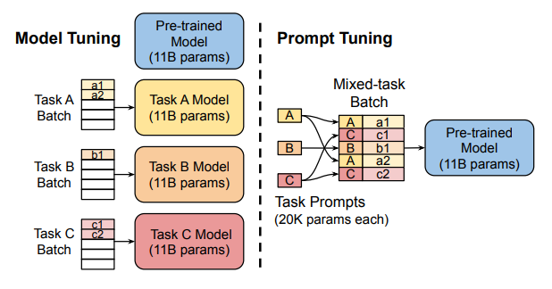
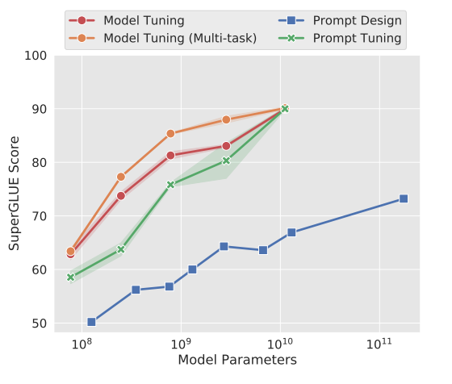
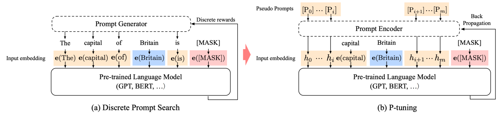

# ch6 高效调参
前文已经对全量微调进行了详细的介绍，本部分我们将介绍高效调参。随着大模型的参数量逐渐增大，百亿、千亿级别的模型逐渐涌现，对大模型进行全量微调的成本很高。需要依赖较高的显存，且训练速度慢、耗时唱。高效参数微调（parameter-efficient finetuning techniques，PEFT）是指微调大模型过程中只训练一部分参数，该方案的优势是硬件资源要求低、训练速度快、耗时短。

本部分将介绍一下五种高效调参的方法
- prompt turning
- prefix turning
- p turning
- adapter
- LoRA

## 6.1 prompt turning

### 方法介绍
论文：***The Power of Scale for Parameter-Efficient Prompt Tuning***
prompt turning是一种简单易用的高效微调方法，该方法同样是希望下游任务能够融合预训练模型的鲜艳只是，并且能够根据很少的数据集队模型的蓄念目标进行修正。prompt turning采用类似“提示模板”的做法来修正该问题。其核心做法是给每个任务定义了自己的Prompt，然后拼接到数据上作为输入，但只在输入层加入prompt tokens，并且不需要加入 MLP 进行调整来解决难训练的问题。并且从论文的描述中，随着参数增加，prompt turning的方法会逼近全参数微调的结果。
 

prompt turning的核心内容有：
- 微调方法：prompt turning没有增加任何层，直接使用prompt模板构建出embeding向量，能够很好的保留预训练模型的先验知识。同时通过低成本、快速迭代的高效微调，能很好的引导大型预训练模型生成符合特定任务需求的正确响应。
- 提出了prompt Ensembling：即在一个批次里训练同一个任务不同的prompt，如今天天气怎么样、今天天气如何等，这样相当于训练了不同的模型，相比于模型集成能够有效降低成本。
- 探讨 prompt token 的初始化方法和长度对模型性能影响，结论发现：当prompt token长度为20是一个较好的经验参数，当模型参数超过20时对模型能行提升不明显；初始化采用类标签的方效果比随机初始化更好。但以上两者都会随着模型参数的提升而消除影响。

### 代码实现
核心微调代码
```python
# 采用经验值：num_virtual_tokens= 20
peft_type = PeftType.PROMPT_TUNING
peft_config = PromptTuningConfig(task_type=TaskType.CAUSAL_LM, num_virtual_tokens=20)
model = AutoModelForSequenceClassification.from_pretrained(model_name_or_path, return_dict=True)
model = get_peft_model(model, peft_config)
model.print_trainable_parameters()
```

推理
```python
base_model = AutoModelForCausalLM.from_pretrained(args.model_name_or_path, torch_dtype=load_type)
model = PeftModel.from_pretrained(base_model, args.ckpt_path, torch_dtype=load_type)
```


## 6.3 p turning

### 方法介绍
论文：
- ***GPT Understands, Too***
- ***P-Tuning v2: Prompt Tuning Can Be Comparable to Fine-tuning Universally Across Scales and Tasks***

前文提到prompt turning 通过构造prompt 模板（prompt template）对大模型进行微调，处理过程中发现大模型的prompt构造方法会严重模型训练效果，虽然针对prompt turning 中prompt模板设计也有很多研究提出了一些方法，但仍然存在模型对人工设计的模板变化特别敏感（尤其是顺序）。因此p turning论文中，设计了一种连续可微的virtual token。


p turning的核心内容有：
- 微调方法：p turning算法和prefix turning的想法相似，通过微调让指令文本去挖掘大模型的潜力去完成特定的任务。但p turning 只将prompt转为可学习的embedding层，并进一步使用MLP+LSTM的方法对prompt embedding进一层处理（创新点，为了增强prompt顺序和连续性）。
- virtual token：prefix turning方法也加入了可微的virtual token，不同的是p turning只在输入层增加了，并且virtual token的位置是可选的。
- 效果：相同参数规模，如果进行全参数微调，Bert的在NLU任务上的效果，超过GPT很多；但是在P-Tuning下，GPT可以取得超越Bert的效果。并且相比于prefix turning和LoRA，p turning的代码微调量很少。

### 代码实现

核心微调代码
```python
# 出num_virtual_tokens外，需要encoder_hidden_size（MLP中间层参数）
peft_type = PeftType.P_TUNING
peft_config = PromptEncoderConfig(task_type=TaskType.CAUSAL_LM, num_virtual_tokens=20, encoder_hidden_size=128)
model = AutoModelForSequenceClassification.from_pretrained(model_name_or_path, return_dict=True)
model = get_peft_model(model, peft_config)
model.print_trainable_parameters()
```

推理
```python
base_model = AutoModelForCausalLM.from_pretrained(args.model_name_or_path, torch_dtype=load_type)
model = PeftModel.from_pretrained(base_model, args.ckpt_path, torch_dtype=load_type)
```
