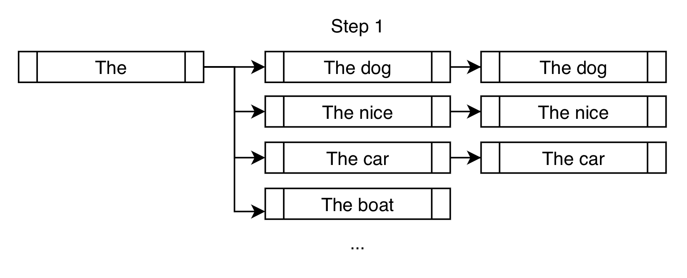
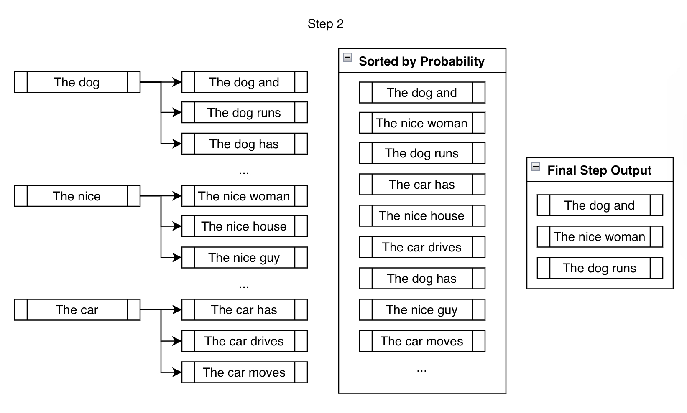
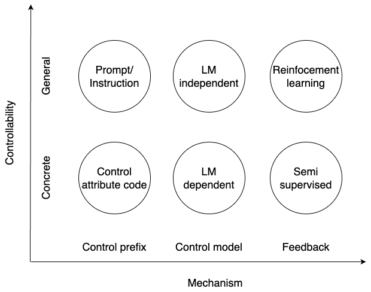

本章结构如下：

- 常用Decoding策略
- 长度背后
- CTG

## Decoding

### Viterbi

Decoding其实是在给定条件下预测下一个状态的一种过程，最早用在信道传输上。Decoding有非常多的方法，对AI相关的算法工程师来说，最经典就是Viterbi算法了。


几个概念：

- 观测序列
- 隐状态序列
- 状态转移矩阵
- 发射矩阵

如果我们有两个矩阵，给定观测序列就可以解码出对应的隐状态序列。解码步骤简略概述如下：

- 对每个观测状态（比如Janet）计算每个隐状态的概率
    - 计算过程为：上一个观测状态的隐状态概率×状态转移概率×发射概率
    - 得到各状态路径概率
- 根据路径概率找到最大概率路径，得到隐状态序列

在第一步选择要在哪些状态上计算概率时有两种方法：

- GreedySearch：选择概率最大的
- BeamSearch：选择前TopN概率的（如上图蓝色块）

### BeamSearch

如下图所示：



beam=3时，每一步会选择3个，上面是第一步。下面是第二步：



如果是Greedy，得到的序列就是`The dog and`，但是在Beam下，最终输出最大概率的序列并不一定是`The dog and`（虽然上面图片看起来把它放在最前面了）。

BeamSearch还有几个变体，比如`group_beam_search`、`constrained_beam_search`等，

### Sample

BeamSearch其实已经很好了，不过依然和GreedySearch一样有两个问题：第一是生成的内容容易重复；第二是高质量的文本和高概率并不一定相关，人更加喜欢有「不一样」的内容，而不是完全可预测的。简单来说，这两个问题其实可以归结为一个点：生成的内容确定性太大。于是就有了采样策略——根据上下文随机采样一个Token，不过注意，这里不是完全随机，而是按照多项式概率分布采样：

```python
# sample
probs = nn.functional.softmax(next_token_scores, dim=-1)
next_tokens = torch.multinomial(probs, num_samples=1).squeeze(1)

# greedy
next_tokens = torch.argmax(next_tokens_scores, dim=-1)

# beam
probs = nn.functional.softmax(next_token_scores, dim=-1)

next_tokens = torch.multinomial(probs, num_samples=2 * num_beams)
next_token_scores = torch.gather(next_token_scores, -1, next_tokens)

next_token_scores, _indices = torch.sort(next_token_scores, descending=True, dim=1)
next_tokens = torch.gather(next_tokens, -1, _indices)
```

这就是目前最主流的做法了。不过为了更好地生成，还有一些细节可以搞一搞。

### top_p and top_k

虽然我们经常说top_p采样或者top_k采样，但这两个点也可以用在GreedySearch和BeamSearch，它的思想简单至极——每次score之前，先把top_X的筛出来，然后就在这top_X中进行下一步。top_p是累计概率大于给定这个阈值，top_k是前k个。后者是硬截断，前者是软截断。

```python
# top_k
indices_to_remove = scores < torch.topk(scores, top_k)[0][..., -1, None]
scores = scores.masked_fill(indices_to_remove, filter_value)

# top_p
sorted_logits, sorted_indices = torch.sort(scores, descending=False)
cumulative_probs = sorted_logits.softmax(dim=-1).cumsum(dim=-1)

sorted_indices_to_remove = cumulative_probs <= (1 - top_p)
# 将排序后的张量散布到原始索引位置
indices_to_remove = sorted_indices_to_remove.scatter(1, sorted_indices, sorted_indices_to_remove)
scores = scores.masked_fill(indices_to_remove, filter_value)
```

所以，我们可以在前面几种策略前就把这个给做了，没有问题。

### one more step

其实和top_p、top_k可以一起做的事情很多，也就是说，你可以对score（一般就是logits）干任何事情。我们这里再介绍两个常见的参数（事情）：`temperature`和`repetition_penalty`，也就是温度和重复惩罚。这两个比较常用。

温度参数就是对score进行平滑，有soft_logits的感觉：

```python
# 𝑞𝑖 =exp(𝑧𝑖/𝑇)/ ∑𝑗exp(𝑧𝑗/𝑇)
for temp in [.1, 1.0, 10.]:
    np.random.seed(42)
    logits = np.random.random((2, 4))
    logits /= temp
    scores = np.exp(logits)
    probs = scores / np.sum(scores, axis=1, keepdims=True)
    print(f"temp: {temp}")
    print(probs.round(3))
"""
temp: 0.1
[[0.003 0.873 0.098 0.026]
 [0.001 0.001 0.    0.998]]
temp: 1.0
[[0.183 0.326 0.262 0.229]
 [0.202 0.202 0.184 0.412]]
temp: 10.0
[[0.243 0.257 0.252 0.248]
 [0.246 0.246 0.244 0.264]]
"""
```

$$
q_i=\frac{\exp (z_i /T) }{\sum_j \exp (z_j /T)}
$$

注意看每个位置的概率值。温度参数越小，概率分布越集中，此时得分高的会更高，生成的相对确定；相反，概率会被平滑，高概率和低概率之间的差距缩小。

重复惩罚和温度有点像，但它是对已经生成的Token的score做处理，如果有Token之前已经生成过了，就会在生成下个Token时对那些已生成的Token的分数进行平滑，让它们的概率不那么大。这个参数越大，越有可能生成和之前不重复的Token。

```python
# 𝑞𝑖 =exp(𝑧𝑖/(𝑇·I(i∈g)))/ ∑𝑗exp(𝑧𝑗/𝑇·I(i∈g)))
score = torch.gather(scores, 1, input_ids)
score = torch.where(score < 0, score * penalty, score / penalty)
scores.scatter_(1, input_ids, score)
```

$$
q_i=\frac{\exp (z_i /(T \cdot I(i \in g)))}{\sum_j \exp (z_j /(T \cdot I(j \in g)))} \quad I(c)=\theta \text { if } \mathrm{c} \text { is True else } 1
$$

注意，这里就只对已经生成过的Token（g表示生成过的Tokens）进行额外的惩罚，其他的依然保持温度参数。

**参考资料**

- [How to generate text: using different decoding methods for language generation with Transformers](https://huggingface.co/blog/how-to-generate)
- [Generating Human-level Text with Contrastive Search in Transformers 🤗](https://huggingface.co/blog/introducing-csearch)
- [Guiding Text Generation with Constrained Beam Search in 🤗 Transformers](https://huggingface.co/blog/constrained-beam-search)
- [Generation](https://huggingface.co/docs/transformers/v4.30.0/en/main_classes/text_generation#transformers.GenerationMixin.group_beam_search)
- [Text generation strategies](https://huggingface.co/docs/transformers/v4.30.0/en/generation_strategies#decoding-strategies)

## 长度背后

本小节我们介绍和长度有关的一些细节。

### 为什么有长度限制？

- 训练资源。序列长度越长，显存占用越高。
- 上下文依赖。在很长的序列中，远离当前位置的单词对于生成下一个单词的影响可能会减弱，因此增加序列的长度对模型的预测能力可能没有明显的好处。

### 外推方案

不同的位置编码兼具有一定的外推性，区别是训练或不训练。

训练的：

- Learned parameters

不训练的：

- Sinusoidal encoding
- NBCE: train/model/context free
- ALiBi: train shot, infer long
- PI: 

## CTG



- Control prefix: CTRL, Prefix/Prompt-tuning
- Control model: 
    - Multi-stage: PEER, Multi-models: DExperts
    - Discriminator
        - Plug and Play: attribute models
        - GeDi: control-code LM and anti-control code LM
- Feedback:
    - Semi-supervised:
        - FAST: Feedback-aware self-training (CLM+Classifier)
        - STaR: Self-Taught Reasoner
    - Reinforcement: 
        - InstructGPT
        - Quark

